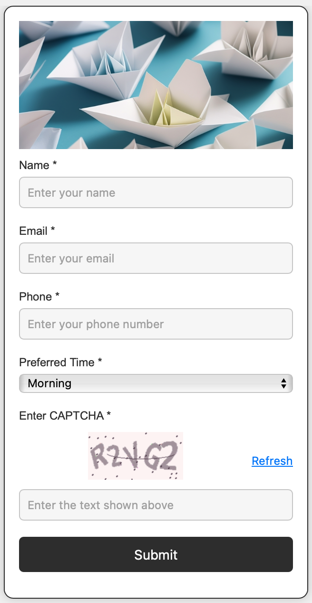
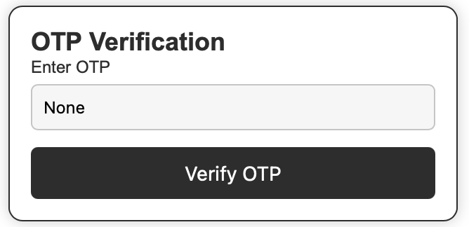
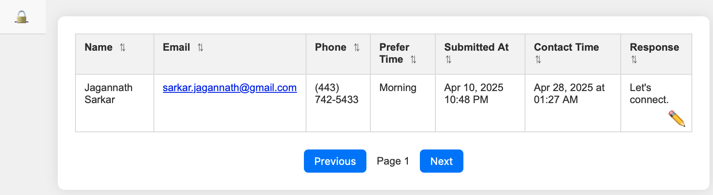
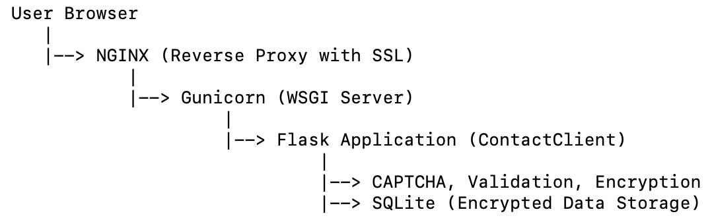

# ContactClient App

**ContactClient** is a secure web-based form designed to collect user contact information safely.
It protects against bots using CAPTCHA, validates phone numbers via external APIs, encrypts sensitive data, and allows administrators to view or manage records after TOTP-based MFA verification. The project is fully containerized with Docker and optimized for production deployment behind an NGINX reverse proxy.


## 🧰 Scope

- **User Management:** Allows users to submit their details including name, email, phone, and preferred time to connect.
- **Admin Authentication:** Admin users are required to complete OTP verification before accessing and managing user data.
- **Data Encryption:** Sensitive information such as name, email, and phone numbers are encrypted using the Fernet encryption scheme.
- **Phone Validation:** Users' phone numbers are validated via the NumVerify API to ensure correctness.
- **CAPTCHA Protection:** A CAPTCHA is generated to prevent automated submissions.
- **Rate Limiting:** Limits the number of requests to prevent abuse and ensure smooth user experience.

## ✨ Features

- 🔒 Encrypted Database Storage (using Fernet)
- 🤖 CAPTCHA Protection (custom-generated and AJAX-validated)
- ☎️ Phone Number Validation (Numverify API)
- 🛡️ Rate Limiting (Flask-Limiter)
- 🧹 Modern Client-Side Validation (WTForms + JavaScript)
- 🔑 MFA (Multi-Factor Authentication) for Admin Dashboard Access (TOTP-based)
- 📦 Dockerized (with docker-compose.yml)
- 🕵️ Session Management (Flask-Session)
- 🛠️ Production Ready (Gunicorn server, NGINX reverse proxy with SSL)
- 🔥 CAPTCHA Refresh Limits (rate-limited refresh button)
- 🌍 Fully Configurable via .env file

  
## 🏗️ Architecture Overview


## 📖 Environment Variables

 ```plaintext
    SECRET_KEY=your_secret_key
    FLASK_ENV=production
    FERNET_KEY=your_fernet_key
    NUMVERIFY_API_KEY=your_numverify_api_key
    DB_NAME=your_db_name.db
    TOTP_SECRET=your_totp_secret
    RATELIMIT_STORAGE_URL=your_ratelimit_storage_url
 ```

## 🚀 Installation

### 🐳 Dockerized Installation

To set up this application in a Docker container, follow these steps:

1. **Clone the Repository:**
    ```bash
    git clone https://github.com/your-username/contact-client-flask.git
    cd contact-client-flask
    ```

2. **Set Up Environment Variables:**

   - Create a `.env` file at the root of the repository


3. **Build and Run the Docker Container:**

    Make sure Docker and Docker Compose are installed. Then, run the following command:

    ```bash
    docker-compose up --build
    ```

    This will build the Docker image and start the application in a container. The application will be available at `http://localhost:8080`.

### ⚙️ Manual Installation

1. **Install Dependencies:**

    Make sure you have Python 3.7+ and pip installed. Then, install the required Python packages by running:

    ```bash
    pip install -r requirements.txt
    ```

2. **Run the Flask Application:**

    Start the Flask app with:

    ```bash
    python app.py
    ```

    The application will run locally on `http://localhost:8080`.

## 🔑 Admin OTP Verification

Admin users must authenticate via OTP before accessing the records. This feature ensures that only authorized personnel can view or add notes to the user data. The OTP is verified using a time-based one-time password (TOTP) algorithm, which is configured with a secret key.

## 🎯 Usage

- **Homepage:** The homepage allows users to submit their details through a form, including name, email, phone number, and preferred time to connect.
- **Admin Panel:** Admin users can access and update records after successful OTP verification.
- **Database:** The user data is stored securely in a SQLite database, with encrypted fields for sensitive information.

## 🔒 Security Features

- All data in the database is encrypted.
- All form inputs are validated both client-side and server-side.
- CSRF protection is enabled for all forms.
- MFA (TOTP) is required for accessing sensitive admin areas.
- Rate limiting protects endpoints against abuse.
- CAPTCHA refresh is rate-limited.
- NGINX SSL/TLS termination is enabled in production (Let’s Encrypt).

## 📜 License

This project is licensed under the MIT License - see the [LICENSE](LICENSE) file for details.

## 🤝 Acknowledgments

- Flask for building the web framework.
- Flask-WTF for form handling.
- Cryptography library for secure encryption and decryption.
- NumVerify for phone number validation.
- PyOTP for OTP generation and verification.
